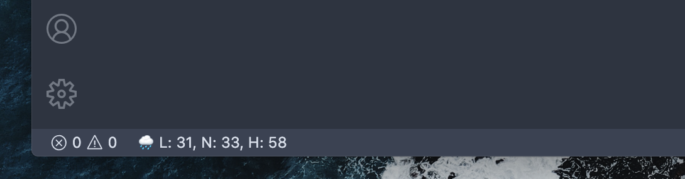
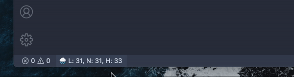
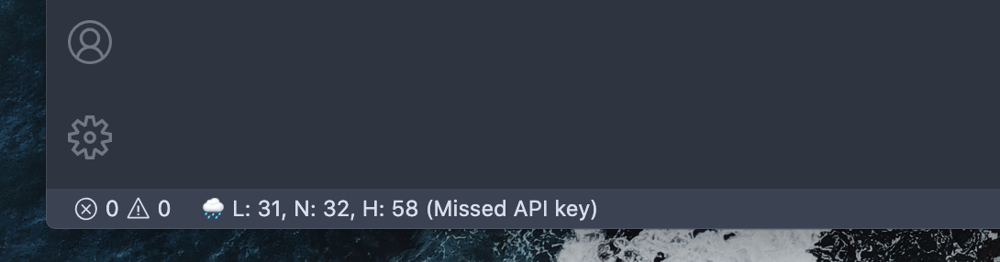
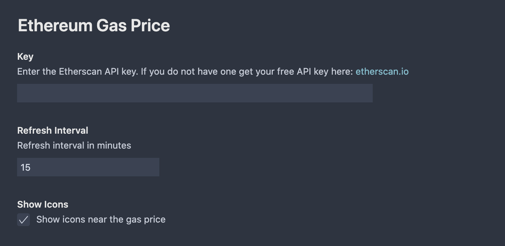

# VS Code Ethereum Gas Price Extension

## About

Get the current Ethereum gas price in the VS Code status bar:

* L - means the safe low gas price
* N - means the normal/average gas price
* H - means the high gas price

The extension shows emoji to indicate the current gas price status:

* 🌤 - means the gas price is low
* 🌧 - means the gas price is high
* 🌩 - means the gas price is extremely high

Extension updates current gas price automatically but you can update it manually by clicking on it:

The extension uses Etherscan API. Etherscan API requires a free API key. You can get one here: [etherscan.io](https://etherscan.io/myapikey). If an API key is not provided extension works, but indicate missed API key:

## Settings

* Etherscan API key - your API key.
* Refresh interval in minutes - how often extension needs to update current gas price.
* Show icons - show or hide emoji icons near the gas price.

## Need Help

If you need any help, please contact me via GitHub issues page: [GitHub](https://github.com/monosux/vscode-ethereum-gas-price/issues)